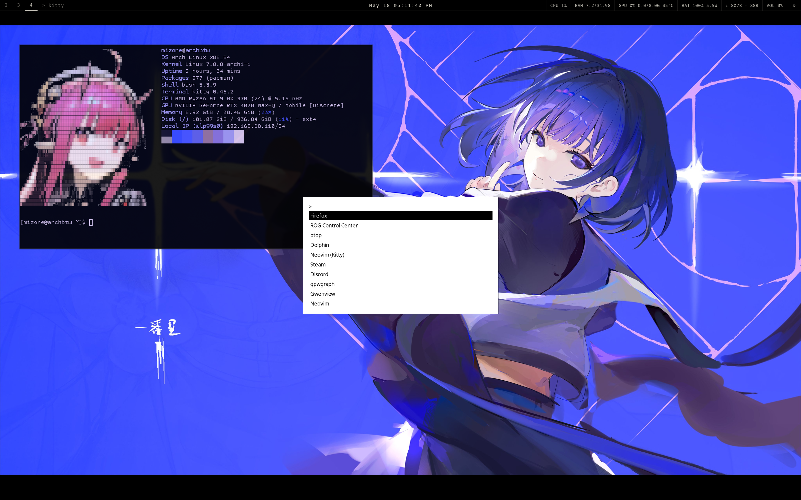
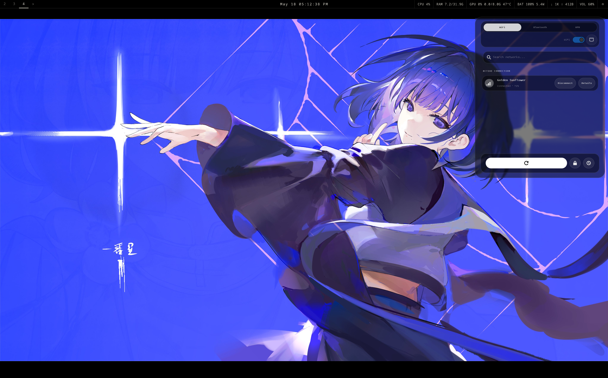
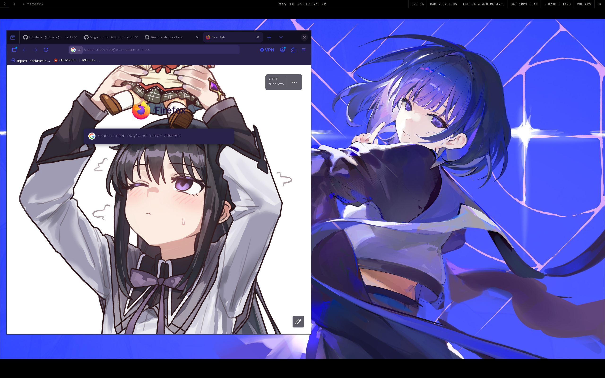
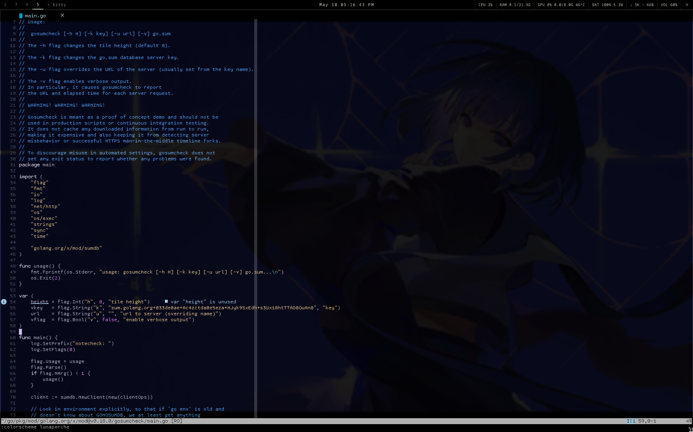
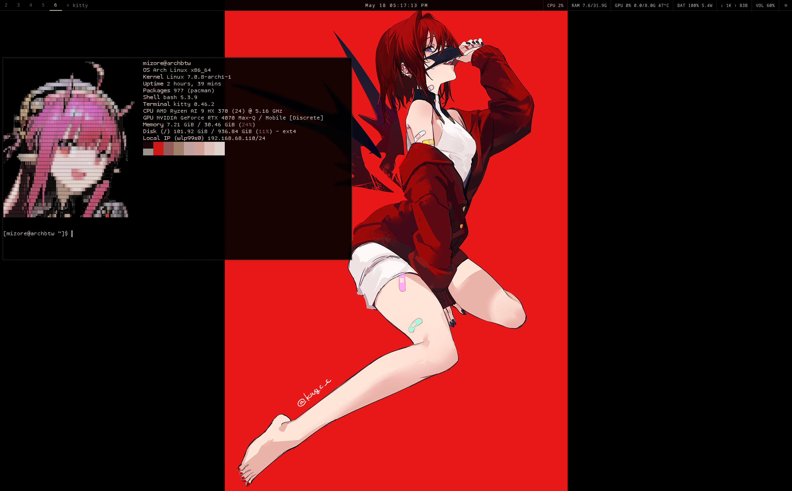

# arch-dotfilescurrent

Private Arch/Hyprland system configuration for reproducing this laptop setup as closely as possible on a fresh install.

This repository is intended for personal restoration, not as a generic public rice. It captures the active Hyprland, Waybar, Orbit, OSD, audio, theme, package, and wallpaper setup while excluding browser secrets and volatile application state.

## Showcase

Current desktop previews are stored in `docs/showcase/`. GitHub README files do not support JavaScript carousels, so this uses a compact horizontal thumbnail strip. Click any preview to open it full-size, then use the browser/GitHub image viewer to move through them.

| Preview | Preview | Preview | Preview | Preview |
| --- | --- | --- | --- | --- |
| [](docs/showcase/Screenshot_20260518_171138.png) | [](docs/showcase/Screenshot_20260518_171237.png) | [](docs/showcase/Screenshot_20260518_171327.png) | [](docs/showcase/Screenshot_20260518_171641.png) | [](docs/showcase/Screenshot_20260518_171712.png) |

## Important Keybindings

| Keybind | Action |
| --- | --- |
| `SUPER + Return` | Open Kitty terminal |
| `SUPER + E` | Open Dolphin through the dark wrapper |
| `SUPER + Space` | Open rofi launcher |
| `SUPER + Q` | Close active window |
| `SUPER + M` | Exit Hyprland |
| `SUPER + V` | Toggle floating, resize, and center active window |
| `SUPER + P` | Toggle pseudo tiling |
| `SUPER + J` | Toggle split layout |
| `SUPER + 1..0` | Switch workspaces 1 through 10 |
| `SUPER + Shift + 1..0` | Move active window to workspace 1 through 10 |
| `SUPER + Arrow keys` | Move active window by direction |
| `SUPER + S` | Toggle special scratchpad workspace |
| `SUPER + Shift + S` | Move active window to scratchpad workspace |
| `SUPER + Mouse left drag` | Move window |
| `SUPER + =` or `SUPER + Numpad +` | Change wallpaper |
| `Print` | Full screenshot |
| `XF86Launch1` | Frozen area screenshot |
| `SUPER + XF86Launch1` | Frozen area screenshot and save |
| `SUPER + F1` | Toggle output mute with OSD |
| `XF86AudioMicMute` | Toggle microphone mute with OSD |
| `XF86AudioLowerVolume` | Lower volume with OSD |
| `XF86AudioRaiseVolume` | Raise volume with OSD |
| `SUPER + F2` | Keyboard brightness down |
| `SUPER + F3` | Keyboard brightness up |
| `SUPER + F7` | Screen brightness down |
| `SUPER + F8` | Screen brightness up |
| `SUPER + I` | Toggle e-ink/grayscale mode |

## Restore

Clone and run:

```bash
git clone https://github.com/YOUR_GITHUB_USER/arch-dotfilescurrent.git
cd arch-dotfilescurrent
./bootstrap.sh
```

If GitHub CLI is used later, replace `YOUR_GITHUB_USER` with the real account or use the SSH remote.

## What This Restores

- Hyprland config, keybinds, layer rules, autostart, and portal startup
- Waybar config, styling, stats modules, dropdowns, and scripts
- Audio dropdown with volume slider and output switching
- Battery/power profile dropdown
- Orbit WiFi/Bluetooth/VPN dropdown config and styling
- Patched Orbit source workflow and local binary install
- User services for Orbit and Bluetooth audio handling
- Local scripts under `~/.local/bin`
- Local desktop launchers under `~/.local/share/applications`
- GTK/Qt/rofi/fuzzel/dunst/wallust/fastfetch/mpv/zathura supporting configs
- Wallpapers/images under `~/Pictures/anime` and `~/Pictures/Backgrounds`
- Pacman/AUR package manifests
- AppImage manifest

## What Is Intentionally Excluded

- Firefox/browser profiles, history, login databases, and cookies
- SSH/private keys and tokens
- OBS state/logs/scenes
- cache directories and generated Python bytecode
- Pulse cookie and other local auth material
- compiled Orbit binary; it is rebuilt from source with a patch
- large AppImage binaries; they are tracked in `appimages/appimages.txt`

## AppImages

Current AppImage manifest:

```bash
./appimages/install-appimages.sh
```

`alcom.AppImage` was present locally at `~/.local/bin/alcom.AppImage`. No stable direct download URL is recorded yet, so the installer prints it as a manual item.

## Docs

- `docs/SYSTEM-DIAGRAM.md`: how the setup connects
- `docs/RESTORE.md`: detailed restore flow and caveats
- `docs/PACKAGES.md`: package restoration notes
- `docs/APPIMAGES.md`: AppImage notes
- `docs/CREDITS.md`: upstream credits
